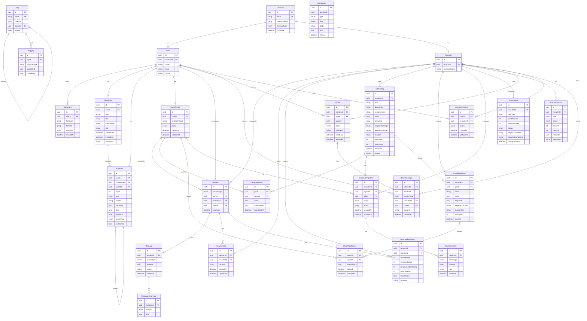

# ER図

```mermaid
erDiagram
    Account ||--o| User : has
    Account ||--o| Recruiter : has

    User ||--o{ Document : owns
    User ||--o{ Experience : has
    User ||--o{ Fragment : has
    User ||--o| AgentProfile : has
    User ||--o{ Session : participates
    User ||--o{ Interest : receives
    User ||--o{ DirectMessage : receives
    User ||--o{ CompanyAccess : has

    Recruiter ||--o{ Session : participates
    Recruiter ||--o{ InterviewNote : writes
    Recruiter ||--o{ InterviewEvaluation : creates
    Recruiter ||--o{ JobPosting : posts
    Recruiter ||--o{ CandidateWatch : creates
    Recruiter ||--o{ CandidatePipeline : manages
    Recruiter ||--o| Subscription : has
    Recruiter ||--o{ PointTransaction : has
    Recruiter ||--o{ Interest : expresses
    Recruiter ||--o{ DirectMessage : sends
    Recruiter ||--o{ CompanyAccess : has

    Experience ||--o{ Fragment : contains
    Fragment ||--o{ Fragment : children

    AgentProfile ||--o{ Session : participates
    AgentProfile ||--o{ CandidateMatch : matched
    AgentProfile ||--o{ WatchNotification : notified
    AgentProfile ||--o{ CandidatePipeline : in

    Session ||--o{ Message : contains
    Session ||--o{ InterviewNote : has
    Session ||--o| InterviewEvaluation : has

    Message ||--o{ MessageReference : has

    Tag ||--o{ Tag : children
    Tag ||--o{ Tagging : used

    JobPosting ||--o{ CandidateMatch : has
    JobPosting ||--o{ CandidatePipeline : for
    JobPosting ||--o{ CandidateWatch : linked

    CandidateWatch ||--o{ WatchNotification : triggers

    CandidatePipeline ||--o{ PipelineHistory : has

    Interest ||--o{ DirectMessage : has

    Account {
        uuid id PK
        string email UK
        string passwordHash
        enum accountType
        datetime createdAt
    }

    User {
        uuid id PK
        uuid accountId FK
        string name
        string email
        string phone
    }

    Recruiter {
        uuid id PK
        uuid accountId FK
        string companyName
    }

    Document {
        uuid id PK
        uuid userId FK
        string fileName
        string filePath
        string summary
        datetime createdAt
    }

    Experience {
        uuid id PK
        uuid userId FK
        enum type
        string title
        string organization
        string role
        datetime periodStart
        datetime periodEnd
        string summary
    }

    Fragment {
        uuid id PK
        uuid userId FK
        uuid experienceId FK
        uuid parentId FK
        int depth
        enum type
        string content
        json metadata
        array skills
        array keywords
        enum sourceType
        float confidence
    }

    AgentProfile {
        uuid id PK
        uuid userId FK
        string systemPrompt
        enum status
        datetime createdAt
        datetime updatedAt
    }

    Session {
        uuid id PK
        enum sessionType
        uuid userId FK
        uuid recruiterId FK
        uuid agentId FK
        datetime createdAt
    }

    Message {
        uuid id PK
        uuid sessionId FK
        enum senderType
        uuid senderId
        string content
        datetime createdAt
    }

    MessageReference {
        uuid id PK
        uuid messageId FK
        enum refType
        uuid refId
    }

    Tag {
        uuid id PK
        string name UK
        enum category
        uuid parentId FK
        array aliases
    }

    Tagging {
        uuid id PK
        uuid tagId FK
        enum taggableType
        uuid taggableId
        float confidence
    }

    InterviewNote {
        uuid id PK
        uuid sessionId FK
        uuid recruiterId FK
        string content
        datetime createdAt
        datetime updatedAt
    }

    InterviewEvaluation {
        uuid id PK
        uuid sessionId FK
        uuid recruiterId FK
        int overallRating
        int technicalRating
        int communicationRating
        int cultureRating
        float matchScore
        string comment
    }

    JobPosting {
        uuid id PK
        uuid recruiterId FK
        string title
        string description
        string requirements
        array skills
        array keywords
        enum employmentType
        enum experienceLevel
        string location
        int salaryMin
        int salaryMax
        boolean isRemote
        enum status
    }

    CandidateMatch {
        uuid id PK
        uuid jobId FK
        uuid agentId FK
        float score
        json scoreDetails
        datetime calculatedAt
    }

    CandidateWatch {
        uuid id PK
        uuid recruiterId FK
        uuid jobId FK
        string name
        array skills
        array keywords
        enum experienceLevel
        string locationPref
        int salaryMin
        boolean isActive
    }

    WatchNotification {
        uuid id PK
        uuid watchId FK
        uuid agentId FK
        float matchScore
        boolean isRead
        datetime createdAt
    }

    CandidatePipeline {
        uuid id PK
        uuid recruiterId FK
        uuid agentId FK
        uuid jobId FK
        enum stage
        string note
        datetime createdAt
        datetime updatedAt
    }

    PipelineHistory {
        uuid id PK
        uuid pipelineId FK
        enum fromStage
        enum toStage
        string note
        datetime createdAt
    }

    Notification {
        uuid id PK
        uuid accountId
        enum type
        string title
        string body
        json data
        boolean isRead
    }

    Subscription {
        uuid id PK
        uuid recruiterId FK
        enum planType
        int pointBalance
        int pointsIncluded
        enum status
        string stripeCustomerId
        string stripeSubscriptionId
        datetime billingCycleStart
    }

    PointTransaction {
        uuid id PK
        uuid recruiterId FK
        enum type
        enum action
        int amount
        int balance
        uuid relatedId
        string description
    }

    Interest {
        uuid id PK
        uuid recruiterId FK
        uuid userId FK
        uuid agentId
        enum status
        string message
        datetime createdAt
        datetime updatedAt
    }

    CompanyAccess {
        uuid id PK
        uuid userId FK
        uuid recruiterId FK
        enum status
        datetime createdAt
        datetime updatedAt
    }

    DirectMessage {
        uuid id PK
        uuid interestId FK
        uuid senderId
        enum senderType
        uuid recruiterId FK
        uuid userId FK
        string content
        datetime createdAt
    }
```
